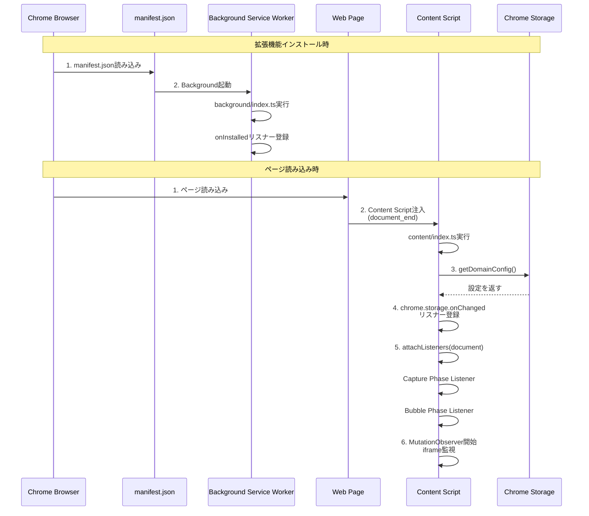
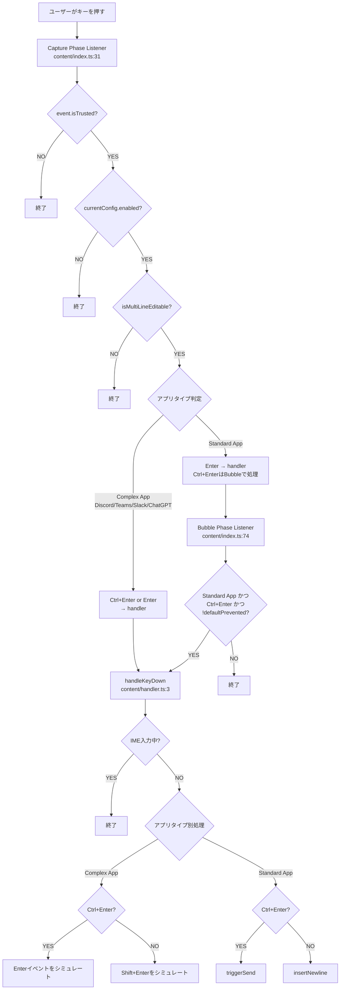
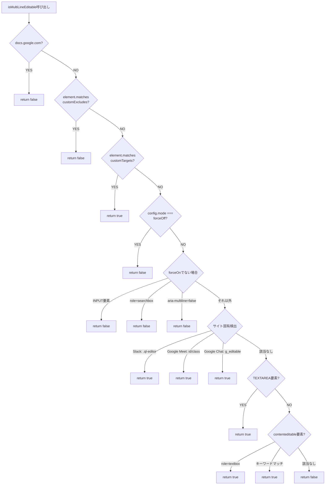
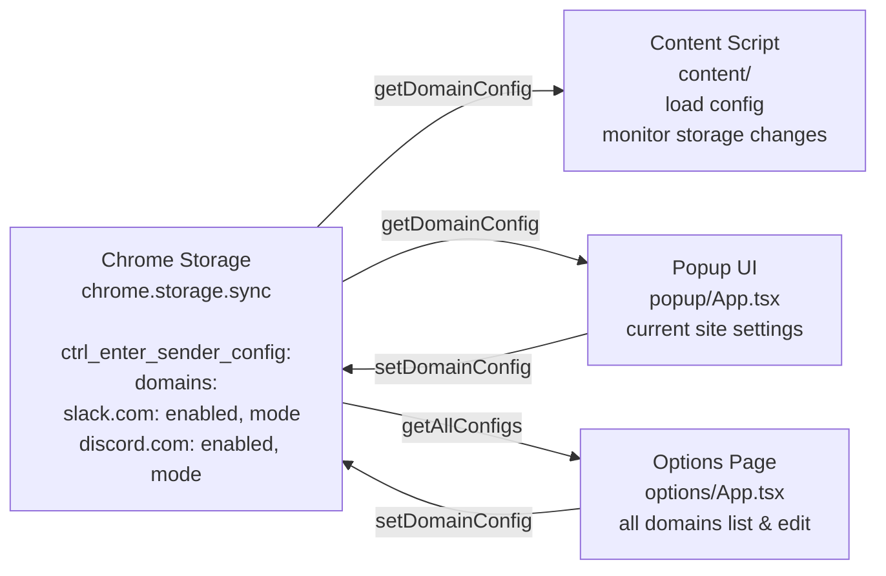
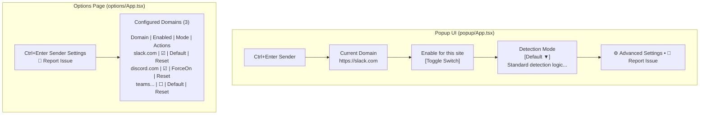

# Ctrl+Enter Sender コード解説

## 📋 目次
1. [全体アーキテクチャ](#全体アーキテクチャ)
2. [拡張機能の起動フロー](#拡張機能の起動フロー)
3. [キーイベント処理フロー](#キーイベント処理フロー)
4. [編集可能要素の検出ロジック](#編集可能要素の検出ロジック)
5. [キー入力ハンドリング詳細](#キー入力ハンドリング詳細)
6. [設定管理システム](#設定管理システム)
7. [UIコンポーネント](#uiコンポーネント)

---

## 全体アーキテクチャ

### 図解：システム全体構造

```mermaid
graph TB
    Browser[Chrome Browser]
    
    subgraph WebPage["Web Page (any site)"]
        InputField["[input field]<br/>TEXTAREA or<br/>contenteditable"]
    end
    
    subgraph Extension["Extension"]
        ContentScript["Content Script<br/>(content/)<br/>• detector.ts<br/>• handler.ts<br/>• index.ts"]
        Background["Background<br/>Service Worker<br/>(background/)<br/>• index.ts<br/>• storage.ts"]
        PopupUI["Popup UI<br/>(popup/)<br/>current site settings"]
        OptionsPage["Options Page<br/>(options/)<br/>all domains settings"]
    end
    
    Storage[Chrome Storage<br/>(config data)]
    
    ContentScript -.monitor.-> InputField
    ContentScript --> Background
    Background -->|chrome.storage.sync| Storage
    PopupUI -->|setDomainConfig| Storage
    OptionsPage -->|setDomainConfig| Storage
    Storage -->|getDomainConfig| ContentScript
    Storage -->|getDomainConfig| Background
```

### 概念説明

この拡張機能は、Chrome拡張機能の標準的な3層構造を採用しています：

1. **Content Script層** (`src/content/`)
   - 各Webページに注入され、ページ上の入力欄を監視
   - キーイベントを捕捉し、Ctrl+Enter/Enterの動作を制御

2. **Background層** (`src/background/`)
   - Service Workerとして動作
   - ストレージ管理と設定の永続化を担当

3. **UI層** (`src/popup/`, `src/options/`)
   - ユーザーが設定を変更するためのインターフェース

### 関連コード

```1:31:manifest.json
{
    "manifest_version": 3,
    "name": "Ctrl+Enter Sender",
    "version": "1.0.2",
    "description": "Send messages with Ctrl+Enter and insert newlines with Enter on various websites.",
    "permissions": [
        "storage"
    ],
    "host_permissions": [
        "<all_urls>"
    ],
    "action": {
        "default_popup": "src/popup/index.html"
    },
    "options_page": "src/options/index.html",
    "background": {
        "service_worker": "src/background/index.ts",
        "type": "module"
    },
    "content_scripts": [
        {
            "matches": [
                "<all_urls>"
            ],
            "js": [
                "src/content/index.ts"
            ],
            "run_at": "document_end"
        }
    ]
}
```

---

## 拡張機能の起動フロー

### 図解：初期化シーケンス



### 概念説明

拡張機能は2つのタイミングで初期化されます：

1. **インストール時**: Background Service Workerが起動し、基本的なセットアップを行う
2. **ページ読み込み時**: Content Scriptが各ページに注入され、そのページ専用の設定を読み込んでイベントリスナーを登録

特に重要なのは、Content Scriptが**Capture Phase**と**Bubble Phase**の両方でキーイベントを監視している点です。これは、サイトによってEnterキーの処理タイミングが異なるため、確実にイベントを捕捉するための設計です。

### 関連コード

```1:23:src/content/index.ts
import { isMultiLineEditable } from './detector';
import { handleKeyDown } from './handler';
import { getDomainConfig } from '../background/storage';
import { DomainConfig } from '../types';

let currentConfig: DomainConfig | null = null;
const origin = window.location.origin;

// Initial config load
getDomainConfig(origin).then(config => {
    currentConfig = config;
    console.log('Ctrl+Enter Sender: Config loaded', config);
});

// Listen for storage changes
chrome.storage.onChanged.addListener((changes, area) => {
    if (area === 'sync' && changes['ctrl_enter_sender_config']) {
        getDomainConfig(origin).then(config => {
            currentConfig = config;
            console.log('Ctrl+Enter Sender: Config updated', config);
        });
    }
});
```

```111:153:src/content/index.ts
// Attach to main document
attachListeners(document);

// Handle iframes (like Google Chat)
const observer = new MutationObserver((mutations) => {
    mutations.forEach((mutation) => {
        mutation.addedNodes.forEach((node) => {
            if (node instanceof HTMLIFrameElement) {
                try {
                    // Try to access iframe document (only works for same-origin)
                    const iframeDoc = node.contentDocument;
                    if (iframeDoc) {
                        attachListeners(iframeDoc);
                    } else {
                        // Wait for load
                        node.addEventListener('load', () => {
                            const loadedDoc = node.contentDocument;
                            if (loadedDoc) {
                                attachListeners(loadedDoc);
                            }
                        });
                    }
                } catch (e) {
                    // Cross-origin iframe, can't access
                }
            }
        });
    });
});

observer.observe(document.body, { childList: true, subtree: true });

// Also check existing iframes
document.querySelectorAll('iframe').forEach(iframe => {
    try {
        const iframeDoc = iframe.contentDocument;
        if (iframeDoc) {
            attachListeners(iframeDoc);
        }
    } catch (e) {
        // Cross-origin
    }
});
```

---

## キーイベント処理フロー

### 図解：キー入力処理の全体フロー



### 概念説明

キーイベント処理は**2段階のイベントフェーズ**で行われます：

1. **Capture Phase (捕獲フェーズ)**
   - イベントがDOMツリーの上から下へ伝播する段階
   - サイトのイベントハンドラより先に実行される
   - Complex App（Discord、Teams、Slack、ChatGPT）では、Ctrl+EnterとEnterの両方をここで処理
   - Standard Appでは、Enterのみをここで処理（デフォルトの送信動作を防ぐため）

2. **Bubble Phase (バブリングフェーズ)**
   - イベントがDOMツリーの下から上へ伝播する段階
   - Standard AppのCtrl+Enterは、サイトが処理しなかった場合のみここで処理
   - `event.defaultPrevented`をチェックして、サイトが既に処理した場合は干渉しない

この設計により、様々なサイトの動作パターンに対応できます。

### 関連コード

```25:71:src/content/index.ts
function attachListeners(doc: Document) {
    console.log('Ctrl+Enter Sender: Attaching listeners to', doc);
    // Unified Keydown Listener (Capture Phase)
    // We use Capture phase for:
    // 1. Plain Enter on ALL sites (to prevent default newline)
    // 2. Ctrl+Enter on Complex Apps (Slack, Discord, Teams) to ensure we intercept before they do.
    doc.addEventListener('keydown', (event) => {
        if (!event.isTrusted) return;
        if (!currentConfig || !currentConfig.enabled) return;

        const target = event.target as HTMLElement;
        const hostname = window.location.hostname;
        const isSlack = hostname.includes('slack.com');

        // Check if target is editable
        if (!isMultiLineEditable(target, currentConfig)) {
            return;
        }

        const isMac = navigator.platform.toUpperCase().indexOf('MAC') >= 0;
        const isSendKey = isMac
            ? event.metaKey && event.key === 'Enter'
            : event.ctrlKey && event.key === 'Enter';
        const isPlainEnter = event.key === 'Enter' && !event.shiftKey && !event.ctrlKey && !event.metaKey && !event.altKey;

        const isDiscord = hostname.includes('discord.com');
        const isTeams = hostname.includes('teams.microsoft.com') || hostname.includes('teams.live.com');
        const isChatGPT = hostname.includes('chatgpt.com') || hostname.includes('openai.com');
        const isComplexApp = isDiscord || isTeams || isSlack || isChatGPT;

        // CASE 1: Complex Apps (Slack, Discord, Teams)
        // Handle BOTH Enter and Ctrl+Enter in Capture phase
        if (isComplexApp) {
            if (isSendKey || isPlainEnter) {
                handleKeyDown(event, target, currentConfig);
            }
            return;
        }

        // CASE 2: Standard Apps
        // Handle Plain Enter in Capture phase (to prevent default newline)
        if (isPlainEnter) {
            handleKeyDown(event, target, currentConfig);
        }

        // Ctrl+Enter for standard apps is handled in Bubble phase (see below)
    }, true);
```

```73:108:src/content/index.ts
    // Bubble Phase Listener (for Standard Apps Ctrl+Enter)
    doc.addEventListener('keydown', (event) => {
        if (!event.isTrusted) return;
        if (!currentConfig || !currentConfig.enabled) return;

        const target = event.target as HTMLElement;
        const hostname = window.location.hostname;

        // Check if target is editable
        if (!isMultiLineEditable(target, currentConfig)) {
            return;
        }

        const isMac = navigator.platform.toUpperCase().indexOf('MAC') >= 0;
        const isSendKey = isMac
            ? event.metaKey && event.key === 'Enter'
            : event.ctrlKey && event.key === 'Enter';

        const isDiscord = hostname.includes('discord.com');
        const isTeams = hostname.includes('teams.microsoft.com') || hostname.includes('teams.live.com');
        const isSlack = hostname.includes('slack.com');
        const isChatGPT = hostname.includes('chatgpt.com') || hostname.includes('openai.com');
        const isComplexApp = isDiscord || isTeams || isSlack || isChatGPT;

        // Complex apps are fully handled in Capture phase, so ignore them here.
        if (isComplexApp) return;

        // Handle Ctrl+Enter for Standard Apps
        // We wait for the site to handle it. If they didn't (defaultPrevented is false), we trigger send.
        if (isSendKey) {
            // If the site already handled it (e.g. Gmail), don't interfere.
            if (event.defaultPrevented) return;

            handleKeyDown(event, target, currentConfig);
        }
    }, false);
```

---

## 編集可能要素の検出ロジック

### 図解：検出判定フローチャート



### 概念説明

`isMultiLineEditable()`関数は、**優先度の高い順**にチェックを行います：

1. **最優先**: ユーザー設定（customExcludes, customTargets, forceOff）
2. **次優先**: サイト固有の検出ロジック（Slack、Google Meet、Google Chatなど）
3. **汎用検出**: TEXTAREA要素や、contenteditable要素でキーワードマッチ

この順序により、ユーザーが明示的に設定した場合はそれを尊重し、そうでない場合は自動検出を試みます。

### 関連コード

```3:99:src/content/detector.ts
export function isMultiLineEditable(element: Element, config?: DomainConfig): boolean {
    if (!element) return false;

    // 0. Check blocked sites
    const hostname = window.location.hostname;
    const isSlack = hostname.includes('slack.com');

    // Google Docs/Sheets/Slides: Enter behavior is complex and custom.
    if (hostname === 'docs.google.com') {
        return false;
    }

    // 1. Check custom excludes
    if (config?.customExcludes) {
        if (element.matches(config.customExcludes.join(','))) {
            return false;
        }
    }

    // 2. Check custom targets
    if (config?.customTargets) {
        if (element.matches(config.customTargets.join(','))) {
            return true;
        }
    }

    // 3. Check forceOff
    if (config?.mode === 'forceOff') {
        return false;
    }

    // 4. Default exclusion rules (unless forceOn)
    if (config?.mode !== 'forceOn') {
        if (element.tagName === 'INPUT') return false;

        const role = element.getAttribute('role');
        if (role === 'searchbox') return false;

        // Exclude single-line text inputs
        const ariaMultiline = element.getAttribute('aria-multiline');
        if (ariaMultiline === 'false') return false;
    }

    // 5. Explicit Slack detection
    if (isSlack) {
        // Slack uses Quill editor with .ql-editor class
        if (element.classList.contains('ql-editor') && (element as HTMLElement).isContentEditable) {
            return true;
        }
    }

    // 6. Explicit Google Meet detection
    const isMeet = hostname.includes('meet.google.com');
    if (isMeet) {
        const id = element.getAttribute('id');
        const className = element.className;
        if (id === 'bfTqV' || className.includes('qdOxv-fmcmS-wGMbrd')) {
            return true;
        }
    }

    // 7. Explicit Google Chat detection
    const isGoogleChat = hostname.includes('chat.google.com') || hostname.includes('mail.google.com');
    if (isGoogleChat) {
        if (element.getAttribute('g_editable') === 'true') {
            return true;
        }
    }

    // 8. Check for TEXTAREA
    if (element.tagName === 'TEXTAREA') {
        return true;
    }

    // 9. Check for contenteditable
    if ((element as HTMLElement).isContentEditable) {
        const role = element.getAttribute('role');
        const ariaLabel = element.getAttribute('aria-label');
        const id = element.getAttribute('id');
        const className = element.className;

        // Keywords that suggest this is a message input
        const keywords = ['message', 'chat', 'compose', 'reply', 'comment', 'post', 'write', 'prompt', 'メッセージ', 'チャット', 'コメント'];
        const hasKeyword = keywords.some(keyword =>
            (ariaLabel && ariaLabel.toLowerCase().includes(keyword.toLowerCase())) ||
            (id && id.toLowerCase().includes(keyword.toLowerCase())) ||
            (className && className.toLowerCase().includes(keyword.toLowerCase()))
        );

        // Accept if role is textbox or if it has message-related keywords
        if (role === 'textbox' || hasKeyword) {
            return true;
        }
    }

    return false;
}
```

---

## キー入力ハンドリング詳細

### 図解：handleKeyDown() の処理分岐

```mermaid
flowchart TD
    Start[handleKeyDown呼び出し] --> IME{IME入力中?<br/>isComposing || keyCode===229}
    IME -->|YES| End1[return 処理しない]
    IME -->|NO| KeyType{キー種別判定}
    
    KeyType -->|isSendKey<br/>Ctrl+Enter/Cmd+Enter| SendKey
    KeyType -->|isPlainEnter<br/>単独Enter| PlainEnter
    
    SendKey --> AppType1{アプリタイプ判定}
    PlainEnter --> AppType2{アプリタイプ判定}
    
    AppType1 -->|Complex App<br/>Discord/Teams| ComplexCtrl[Ctrl+Enter処理]
    AppType1 -->|Standard App<br/>Slack/ChatGPT/その他| StandardCtrl[Ctrl+Enter処理]
    
    AppType2 -->|Complex App| ComplexEnter[Enter処理]
    AppType2 -->|Standard App| StandardEnter[Enter処理]
    
    ComplexCtrl --> Prevent1[preventDefault<br/>stopImmediatePropagation]
    Prevent1 --> SimEnter[Enterイベントをシミュレート<br/>keydown/keypress/keyup]
    
    ComplexEnter --> Prevent2[preventDefault<br/>stopImmediatePropagation]
    Prevent2 --> InsertNewline1[insertNewline]
    InsertNewline1 --> SimShiftEnter[Shift+Enterをシミュレート]
    
    StandardCtrl --> Prevent3[preventDefault<br/>stopImmediatePropagation]
    Prevent3 --> TriggerSend[triggerSend]
    TriggerSend --> SlackCheck{Slack?}
    SlackCheck -->|YES| SlackButton[Slack専用処理<br/>ボタン検索]
    SlackCheck -->|NO| FormCheck{form要素?}
    FormCheck -->|YES| FormSubmit[form.requestSubmit]
    FormCheck -->|NO| ButtonSearch[送信ボタン検索<br/>複数セレクタ]
    ButtonSearch -->|見つからない| FallbackEnter[Enterイベント発火<br/>フォールバック]
    
    StandardEnter --> Prevent4[preventDefault<br/>stopImmediatePropagation]
    Prevent4 --> InsertNewline2[insertNewline]
    InsertNewline2 --> ElementType{TEXTAREA?}
    ElementType -->|YES| SetRangeText[setRangeText'\n']
    ElementType -->|NO| ContentEditable{contenteditable?}
    ContentEditable -->|Complex App| SimShiftEnter2[Shift+Enterシミュレート]
    ContentEditable -->|Standard App| ExecCommand[execCommand'insertText']
    ExecCommand -->|失敗| RangeOp[Range操作<br/>フォールバック]
```

### 概念説明

`handleKeyDown()`関数は、アプリケーションの種類に応じて異なる戦略を取ります：

1. **Complex App (Discord, Teams)**
   - これらのアプリは、Enterキーで送信、Shift+Enterで改行という標準的な動作をします
   - Ctrl+Enterで送信したい場合：Enterイベントをシミュレートして、アプリの送信処理をトリガー
   - Enterで改行したい場合：Shift+Enterイベントをシミュレート

2. **Standard App (Slack, ChatGPT, その他)**
   - 送信ボタンを探してクリックするか、フォーム送信を試みます
   - Slackは特別なDOM構造を持つため、専用の検索ロジックがあります

3. **改行挿入**
   - TEXTAREA要素：`setRangeText()`を使用（Undo/Redo対応）
   - contenteditable要素：`execCommand('insertText')`を使用（非推奨だが互換性のため）

### 関連コード

```3:75:src/content/handler.ts
export function handleKeyDown(event: KeyboardEvent, target: HTMLElement, _config?: DomainConfig) {
    // 1. IME Check
    if (event.isComposing || event.keyCode === 229) {
        return;
    }

    const isMac = navigator.platform.toUpperCase().indexOf('MAC') >= 0;
    const isSendKey = isMac
        ? event.metaKey && event.key === 'Enter'
        : event.ctrlKey && event.key === 'Enter';

    const isPlainEnter = event.key === 'Enter' && !event.shiftKey && !event.ctrlKey && !event.metaKey && !event.altKey;

    // Check if we're on Discord or Teams
    const isDiscord = window.location.hostname.includes('discord.com');
    const isTeams = window.location.hostname.includes('teams.microsoft.com') || window.location.hostname.includes('teams.live.com');
    // Slack and ChatGPT are handled via triggerSend (button click)
    const isComplexApp = isDiscord || isTeams;

    // Special handling for Complex Apps (Discord, Teams)
    if (isComplexApp) {
        if (isSendKey) {
            // Ctrl+Enter on Complex Apps: Trigger Send
            // These apps usually send on Enter.
            // We simulate a plain Enter keypress to trigger their send action.
            event.preventDefault();
            event.stopImmediatePropagation();

            const events = ['keydown', 'keypress', 'keyup'];
            events.forEach(eventType => {
                const newEvent = new KeyboardEvent(eventType, {
                    key: 'Enter',
                    code: 'Enter',
                    keyCode: 13,
                    which: 13,
                    bubbles: true,
                    cancelable: true,
                    view: window
                });
                target.dispatchEvent(newEvent);
            });
            return;
        }

        if (isPlainEnter) {
            // Plain Enter: simulate Shift+Enter (newline)
            // These apps natively handle Shift+Enter to insert a newline.
            event.preventDefault();
            event.stopImmediatePropagation();
            insertNewline(target);
            return;
        }
        return;
    }

    // Non-Complex sites (Slack, ChatGPT, Standard Apps)
    if (isSendKey) {
        // If we reached here in Bubble phase and defaultPrevented is false (checked in index.ts),
        // it means the site didn't handle Ctrl+Enter. We should trigger send.
        event.preventDefault();
        event.stopImmediatePropagation();
        triggerSend(target);
        return;
    }

    if (isPlainEnter) {
        // We want to stop the default send behavior and insert a newline.
        event.preventDefault();
        event.stopImmediatePropagation();
        insertNewline(target);
        return;
    }
}
```

```135:265:src/content/handler.ts
function triggerSend(target: HTMLElement) {
    // Special handling for Slack
    const isSlack = window.location.hostname.includes('slack.com');
    if (isSlack) {
        // Slack's DOM structure is complex. The input (.ql-editor) is deep inside.
        // The send button (button[data-qa="texty_send_button"]) is usually in a toolbar or footer relative to the editor.

        // Strategy 1: Find the main editor container and search within it.
        // Known containers: .c-texty_input_unstyled__container, .c-message_kit__editor
        let container = target.closest('.c-texty_input_unstyled__container') ||
            target.closest('.c-message_kit__editor') ||
            target.closest('[data-qa="message_editor"]');

        if (container) {
            // Sometimes the button is a sibling of the container's parent, or inside the container.
            // Let's search inside first.
            let sendButton = container.querySelector('button[data-qa="texty_send_button"]');

            // If not found inside, check the parent (often the button is in a footer sibling)
            if (!sendButton && container.parentElement) {
                sendButton = container.parentElement.querySelector('button[data-qa="texty_send_button"]');
            }

            if (sendButton instanceof HTMLElement) {
                sendButton.click();
                return;
            }
        }

        // Strategy 2: Traverse up manually a few levels
        let current = target.parentElement;
        for (let i = 0; i < 10 && current; i++) {
            const sendButton = current.querySelector('button[data-qa="texty_send_button"]');
            if (sendButton instanceof HTMLElement) {
                sendButton.click();
                return;
            }
            current = current.parentElement;
        }
    }

    // 1. Try form submission
    const form = target.closest('form');
    if (form) {
        // Try requestSubmit first (triggers validation and submit event)
        if (typeof form.requestSubmit === 'function') {
            form.requestSubmit();
            return;
        }
        // Fallback to submit() (skips validation/event listeners sometimes, use with caution)
        form.submit();
        return;
    }

    // 2. Search for send button
    const selectors = [
        'button[type="submit"]',
        'button[aria-label*="Send"]',
        'button[aria-label*="送信"]',
        '[data-testid*="send"]',
        '[data-testid*="submit"]',
        'button[class*="send"]',
        'div[role="button"][aria-label*="送信"]',
        'div[role="button"][aria-label*="Send"]', // Common in modern apps
        'div[role="button"][class*="send"]',
        'button[title*="Send"]',
        'button[title*="送信"]',
        // Slack
        'button[data-qa="texty_send_button"]',
        'button[aria-label="Send now"]',
        // Google Chat / Meet
        'div[role="button"][aria-label="Send message"]',
        'div[role="button"][aria-label="メッセージを送信"]',
        'button[aria-label="メッセージを送信"]', // Meet specific
        'button[jsname="SoqoBf"]', // Meet specific jsname
        // Messenger
        'div[aria-label="Press Enter to send"]',
        'div[aria-label="Send"]'
    ];
    let container = target.parentElement;
    let button: Element | null = null;

    // Traverse up a few levels to find a container that might hold the button
    for (let i = 0; i < 7 && container; i++) {
        for (const selector of selectors) {
            button = container.querySelector(selector);
            if (button) break;
        }
        if (button) break;
        container = container.parentElement;
    }

    if (button && button instanceof HTMLElement) {
        button.click();
    } else {
        // Fallback: Dispatch a "real" Enter key event.
        const enterEvent = new KeyboardEvent('keydown', {
            key: 'Enter',
            code: 'Enter',
            keyCode: 13,
            which: 13,
            bubbles: true,
            cancelable: true,
            view: window
        });
        target.dispatchEvent(enterEvent);

        // Also dispatch keypress/keyup for completeness
        const keypressEvent = new KeyboardEvent('keypress', {
            key: 'Enter',
            code: 'Enter',
            keyCode: 13,
            which: 13,
            bubbles: true,
            cancelable: true,
            view: window
        });
        target.dispatchEvent(keypressEvent);

        const keyupEvent = new KeyboardEvent('keyup', {
            key: 'Enter',
            code: 'Enter',
            keyCode: 13,
            which: 13,
            bubbles: true,
            cancelable: true,
            view: window
        });
        target.dispatchEvent(keyupEvent);
    }
}
```

---

## 設定管理システム

### 図解：設定データフロー



### 概念説明

設定は`chrome.storage.sync`に保存され、以下の構造を持ちます：

```typescript
{
  ctrl_enter_sender_config: {
    domains: {
      [origin: string]: DomainConfig
    }
  }
}
```

各ドメインごとに独立した設定を持ち、以下の情報を含みます：
- `enabled`: 拡張機能が有効かどうか
- `mode`: 検出モード（'default' | 'forceOn' | 'forceOff'）
- `customTargets`: カスタムセレクタ（明示的にターゲットにする要素）
- `customExcludes`: カスタム除外セレクタ（明示的に除外する要素）

Content Scriptは、ストレージ変更を監視してリアルタイムで設定を更新します。

### 関連コード

```1:33:src/background/storage.ts
import { DomainConfig, StorageSchema } from '../types';

const STORAGE_KEY = 'ctrl_enter_sender_config';

export async function getDomainConfig(origin: string): Promise<DomainConfig> {
    const data = await chrome.storage.sync.get(STORAGE_KEY);
    const config = data[STORAGE_KEY] as StorageSchema | undefined;

    if (config?.domains?.[origin]) {
        return config.domains[origin];
    }

    // Default config
    return {
        enabled: true,
        mode: 'default'
    };
}

export async function setDomainConfig(origin: string, config: DomainConfig): Promise<void> {
    const data = await chrome.storage.sync.get(STORAGE_KEY);
    const currentSchema = (data[STORAGE_KEY] as StorageSchema) || { domains: {} };

    currentSchema.domains[origin] = config;

    await chrome.storage.sync.set({ [STORAGE_KEY]: currentSchema });
}

export async function getAllConfigs(): Promise<StorageSchema> {
    const data = await chrome.storage.sync.get(STORAGE_KEY);
    return (data[STORAGE_KEY] as StorageSchema) || { domains: {} };
}
```

```1:10:src/types/index.ts
export type DomainMode = 'default' | 'forceOn' | 'forceOff';

export interface DomainConfig {
    enabled: boolean;
    mode: DomainMode;
    customTargets?: string[];
    customExcludes?: string[];
}

export interface StorageSchema {
    domains: {
        [origin: string]: DomainConfig;
    };
}
```

---

## UIコンポーネント

### 図解：UIコンポーネント構造



### 概念説明

UIは2つのコンポーネントで構成されます：

1. **Popup UI** (`popup/App.tsx`)
   - 拡張機能アイコンをクリックすると表示される
   - 現在開いているタブのドメイン設定を表示・編集
   - 簡易的な設定変更が可能

2. **Options Page** (`options/App.tsx`)
   - 右クリックメニューから「オプション」で開く
   - 全ドメインの設定を一覧表示
   - 一括管理が可能

両方ともReactで実装され、`storage.ts`の関数を使用して設定を読み書きします。

### 関連コード

```1:107:src/popup/App.tsx
import React, { useEffect, useState } from 'react';
import { getDomainConfig, setDomainConfig } from '../background/storage';
import { DomainConfig, DomainMode } from '../types';

function App() {
    const [origin, setOrigin] = useState<string>('');
    const [config, setConfig] = useState<DomainConfig | null>(null);

    useEffect(() => {
        chrome.tabs.query({ active: true, currentWindow: true }, async (tabs) => {
            const tab = tabs[0];
            if (tab?.url) {
                const url = new URL(tab.url);
                const tabOrigin = url.origin;
                setOrigin(tabOrigin);
                const loadedConfig = await getDomainConfig(tabOrigin);
                setConfig(loadedConfig);
            }
        });
    }, []);

    const handleEnabledChange = async (e: React.ChangeEvent<HTMLInputElement>) => {
        if (!config || !origin) return;
        const newConfig = { ...config, enabled: e.target.checked };
        setConfig(newConfig);
        await setDomainConfig(origin, newConfig);
    };

    const handleModeChange = async (e: React.ChangeEvent<HTMLSelectElement>) => {
        if (!config || !origin) return;
        const newConfig = { ...config, mode: e.target.value as DomainMode };
        setConfig(newConfig);
        await setDomainConfig(origin, newConfig);
    };

    if (!origin) {
        return <div style={{ padding: '16px' }}>Loading...</div>;
    }

    if (!config) {
        return <div style={{ padding: '16px' }}>Loading config...</div>;
    }

    return (
        <div className="container">
            <div className="header">
                <h2 className="title">Ctrl+Enter Sender</h2>
            </div>

            <div className="card">
                <div className="domain-label">Current Domain</div>
                <div className="domain-value">{origin}</div>
            </div>

            <div className="card row">
                <label htmlFor="enabled-toggle" className="label" style={{ cursor: 'pointer' }}>Enable for this site</label>
                <label className="switch">
                    <input
                        id="enabled-toggle"
                        type="checkbox"
                        checked={config.enabled}
                        onChange={handleEnabledChange}
                    />
                    <span className="slider"></span>
                </label>
            </div>

            <div className="card">
                <label className="label" style={{ display: 'block', marginBottom: '12px' }}>Detection Mode</label>
                <select
                    value={config.mode}
                    onChange={handleModeChange}
                >
                    <option value="default">Default (Auto Detect)</option>
                    <option value="forceOn">Force On (Aggressive)</option>
                    <option value="forceOff">Force Off (Disable)</option>
                </select>
                <div className="description">
                    {config.mode === 'default' && 'Standard detection logic. Works on most sites.'}
                    {config.mode === 'forceOn' && 'Treats almost all inputs as targets. Use if detection fails.'}
                    {config.mode === 'forceOff' && 'Completely disables the extension on this site.'}
                </div>
            </div>

            <div className="footer">
                <button
                    className="link-button"
                    onClick={() => chrome.runtime.openOptionsPage()}
                >
                    <span>⚙️</span> Advanced Settings
                </button>
                <span style={{ margin: '0 8px', color: 'var(--border-color)' }}>•</span>
                <a
                    className="link-button"
                    href="https://github.com/kimura512/ctrlEnterSenderA/issues"
                    target="_blank"
                    rel="noopener noreferrer"
                >
                    <span>🐛</span> Report Issue
                </a>
            </div>
        </div>
    );
}

export default App;
```

```1:109:src/options/App.tsx
import { useEffect, useState } from 'react';
import { getAllConfigs, setDomainConfig } from '../background/storage';
import { StorageSchema, DomainConfig } from '../types';

function App() {
    const [data, setData] = useState<StorageSchema | null>(null);

    useEffect(() => {
        loadData();
    }, []);

    const loadData = async () => {
        const configs = await getAllConfigs();
        setData(configs);
    };

    const handleConfigChange = async (origin: string, newConfig: DomainConfig) => {
        await setDomainConfig(origin, newConfig);
        await loadData();
    };

    if (!data) {
        return <div style={{ padding: '24px' }}>Loading...</div>;
    }

    const domains = Object.keys(data.domains);

    return (
        <div className="container">
            <div style={{ display: 'flex', justifyContent: 'space-between', alignItems: 'center', marginBottom: '24px' }}>
                <h1 style={{ margin: 0 }}>Ctrl+Enter Sender Settings</h1>
                <a
                    className="link-button"
                    href="https://github.com/kimura512/ctrlEnterSenderA/issues"
                    target="_blank"
                    rel="noopener noreferrer"
                    style={{ fontSize: '14px' }}
                >
                    <span>🐛</span> Report Issue
                </a>
            </div>

            <div className="card">
                <div className="card-header">
                    Configured Domains ({domains.length})
                </div>

                {domains.length === 0 ? (
                    <div className="empty-state">
                        No domain configurations saved yet. Visit a site and use the popup to configure.
                    </div>
                ) : (
                    <table>
                        <thead>
                            <tr>
                                <th>Domain</th>
                                <th>Enabled</th>
                                <th>Mode</th>
                                <th>Actions</th>
                            </tr>
                        </thead>
                        <tbody>
                            {domains.map(origin => {
                                const config = data.domains[origin];
                                return (
                                    <tr key={origin}>
                                        <td className="domain-cell">{origin}</td>
                                        <td>
                                            <input
                                                type="checkbox"
                                                checked={config.enabled}
                                                onChange={(e) => handleConfigChange(origin, { ...config, enabled: e.target.checked })}
                                            />
                                        </td>
                                        <td>
                                            <select
                                                value={config.mode}
                                                onChange={(e) => handleConfigChange(origin, { ...config, mode: e.target.value as any })}
                                            >
                                                <option value="default">Default</option>
                                                <option value="forceOn">Force On</option>
                                                <option value="forceOff">Force Off</option>
                                            </select>
                                        </td>
                                        <td>
                                            <button
                                                className="btn-reset"
                                                onClick={() => {
                                                    if (confirm(`Are you sure you want to reset settings for ${origin}?`)) {
                                                        handleConfigChange(origin, { enabled: true, mode: 'default' });
                                                    }
                                                }}
                                            >
                                                Reset
                                            </button>
                                        </td>
                                    </tr>
                                );
                            })}
                        </tbody>
                    </table>
                )}
            </div>
        </div>
    );
}

export default App;
```

---

## まとめ

この拡張機能は、以下の特徴を持つChrome拡張機能です：

1. **柔軟なイベント処理**: Capture PhaseとBubble Phaseの両方でキーイベントを監視し、様々なサイトの動作パターンに対応
2. **賢い要素検出**: サイト固有の検出ロジックと汎用検出を組み合わせ、ユーザー設定を優先
3. **設定の永続化**: Chrome Storage APIを使用して、ドメインごとの設定を保存
4. **ユーザーフレンドリーなUI**: PopupとOptions Pageで、簡単に設定を変更可能

各コンポーネントは独立して動作しながらも、ストレージを通じて連携し、統一された動作を実現しています。


