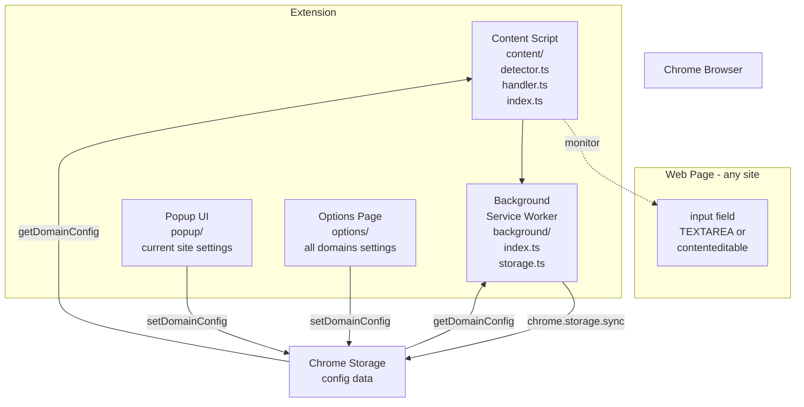
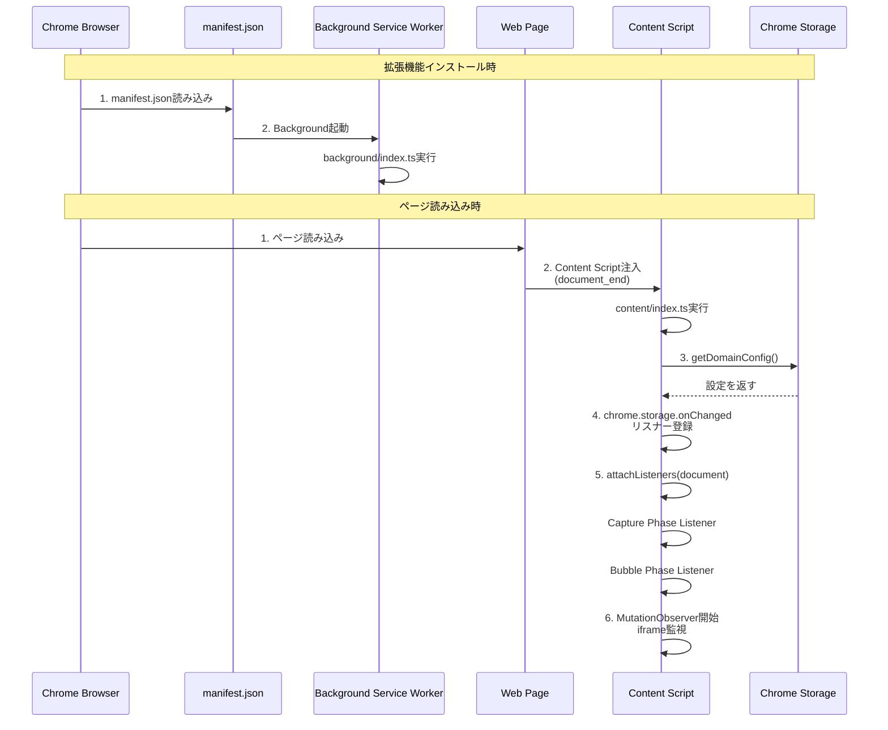
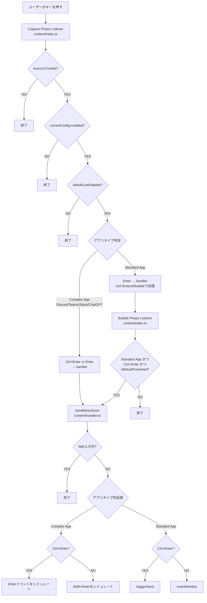
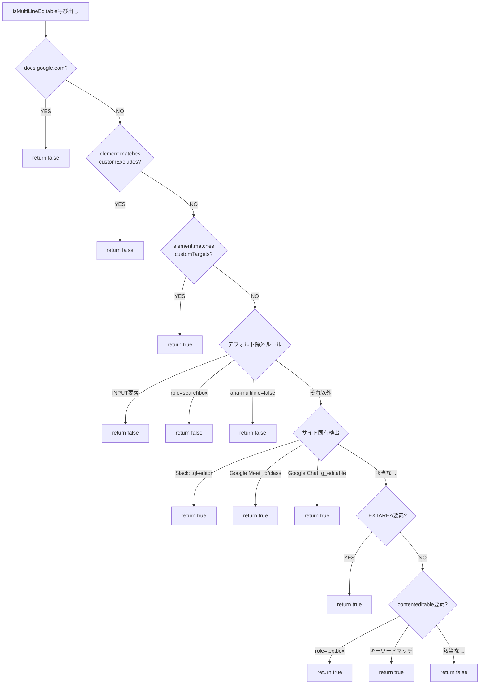
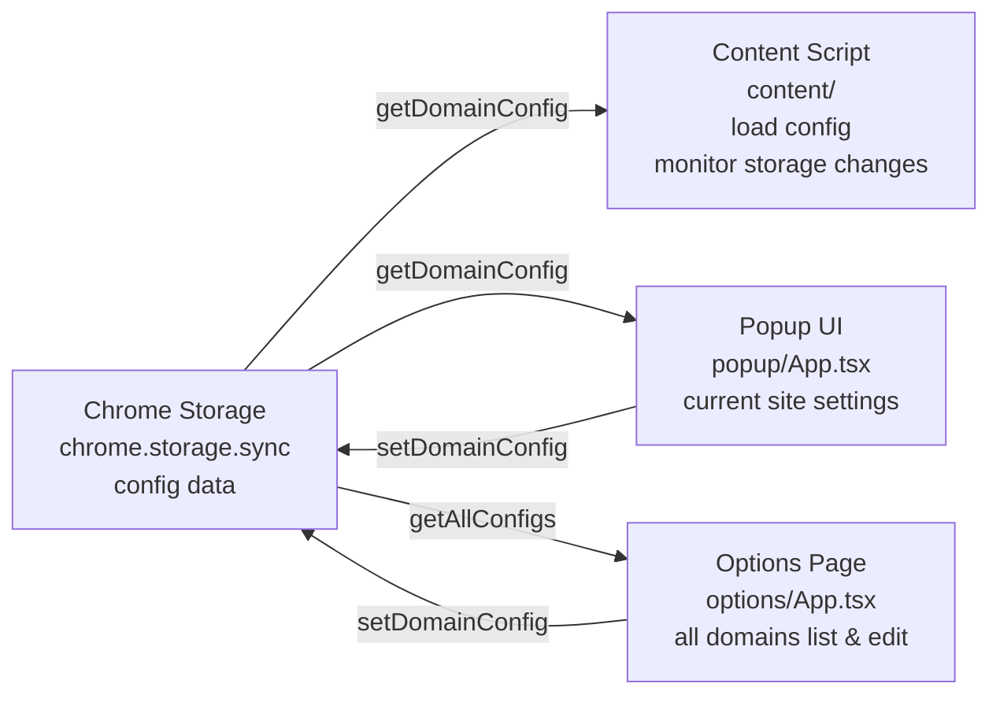

# Ctrl+Enter Sender アーキテクチャ解説

## 📋 目次
1. [全体アーキテクチャ](#全体アーキテクチャ)
2. [拡張機能の起動フロー](#拡張機能の起動フロー)
3. [キーイベント処理フロー](#キーイベント処理フロー)
4. [編集可能要素の検出ロジック](#編集可能要素の検出ロジック)
5. [キー入力ハンドリング詳細](#キー入力ハンドリング詳細)
6. [設定管理システム](#設定管理システム)
7. [UIコンポーネント](#uiコンポーネント)

---

## 全体アーキテクチャ

### 図解：システム全体構造



### 概念説明

この拡張機能は、Chrome拡張機能の標準的な3層構造を採用しています：

1. **Content Script層** (`src/content/`)
   - 各Webページに注入され、ページ上の入力欄を監視
   - キーイベントを捕捉し、Ctrl+Enter/Enterの動作を制御

2. **Background層** (`src/background/`)
   - Service Workerとして動作
   - ストレージ管理と設定の永続化を担当

3. **UI層** (`src/popup/`, `src/options/`)
   - ユーザーが設定を変更するためのインターフェース

### 関連コード

```1:32:manifest.json
{
    "manifest_version": 3,
    "name": "__MSG_extensionName__",
    "version": "1.0.2",
    "description": "__MSG_extensionDescription__",
    "default_locale": "en",
    "permissions": [
        "storage"
    ],
    "host_permissions": [
        "<all_urls>"
    ],
    "action": {
        "default_popup": "src/popup/index.html"
    },
    "options_page": "src/options/index.html",
    "background": {
        "service_worker": "src/background/index.ts",
        "type": "module"
    },
    "content_scripts": [
        {
            "matches": [
                "<all_urls>"
            ],
            "js": [
                "src/content/index.ts"
            ],
            "run_at": "document_end"
        }
    ]
}
```

---

## 拡張機能の起動フロー

### 図解：初期化シーケンス



### 概念説明

拡張機能は2つのタイミングで初期化されます：

1. **インストール時**: Background Service Workerが起動し、基本的なセットアップを行う
2. **ページ読み込み時**: Content Scriptが各ページに注入され、そのページ専用の設定を読み込んでイベントリスナーを登録

特に重要なのは、Content Scriptが**Capture Phase**と**Bubble Phase**の両方でキーイベントを監視している点です。これは、サイトによってEnterキーの処理タイミングが異なるため、確実にイベントを捕捉するための設計です。

---

## キーイベント処理フロー

### 図解：キー入力処理の全体フロー



### 概念説明

キーイベント処理は**2段階のイベントフェーズ**で行われます：

1. **Capture Phase (捕獲フェーズ)**
   - イベントがDOMツリーの上から下へ伝播する段階
   - サイトのイベントハンドラより先に実行される
   - Complex App（Discord、Teams、Slack、ChatGPT）では、Ctrl+EnterとEnterの両方をここで処理
   - Standard Appでは、Enterのみをここで処理（デフォルトの送信動作を防ぐため）

2. **Bubble Phase (バブリングフェーズ)**
   - イベントがDOMツリーの下から上へ伝播する段階
   - Standard AppのCtrl+Enterは、サイトが処理しなかった場合のみここで処理
   - `event.defaultPrevented`をチェックして、サイトが既に処理した場合は干渉しない

この設計により、様々なサイトの動作パターンに対応できます。

---

## 編集可能要素の検出ロジック

### 図解：検出判定フローチャート



### 概念説明

`isMultiLineEditable()`関数は、**優先度の高い順**にチェックを行います：

1. **最優先**: ユーザー設定（customExcludes, customTargets）
2. **次優先**: サイト固有の検出ロジック（Slack、Google Meet、Google Chatなど）
3. **汎用検出**: TEXTAREA要素や、contenteditable要素でキーワードマッチ

この順序により、ユーザーが明示的に設定した場合はそれを尊重し、そうでない場合は自動検出を試みます。

**注意**: 検出モード（mode）機能は削除され、常に自動検出が使用されます。

---

## キー入力ハンドリング詳細

### 概念説明

`handleKeyDown()`関数は、アプリケーションの種類に応じて異なる戦略を取ります：

1. **Complex App (Discord, Teams)**
   - これらのアプリは、Enterキーで送信、Shift+Enterで改行という標準的な動作をします
   - Ctrl+Enterで送信したい場合：Enterイベントをシミュレートして、アプリの送信処理をトリガー
   - Enterで改行したい場合：Shift+Enterイベントをシミュレート

2. **Standard App (Slack, ChatGPT, その他)**
   - 送信ボタンを探してクリックするか、フォーム送信を試みます
   - Slackは特別なDOM構造を持つため、専用の検索ロジックがあります

3. **改行挿入**
   - TEXTAREA要素：`setRangeText()`を使用（Undo/Redo対応）
   - contenteditable要素：`execCommand('insertText')`を使用（非推奨だが互換性のため）

---

## 設定管理システム

### 図解：設定データフロー



### 概念説明

設定は`chrome.storage.sync`に保存され、以下の構造を持ちます：

```typescript
{
  ctrl_enter_sender_config: {
    domains: {
      [origin: string]: DomainConfig
    }
  }
}
```

各ドメインごとに独立した設定を持ち、以下の情報を含みます：
- `enabled`: 拡張機能が有効かどうか
- `customTargets`: カスタムセレクタ（明示的にターゲットにする要素）
- `customExcludes`: カスタム除外セレクタ（明示的に除外する要素）

**注意**: `mode`プロパティは削除されました。検出は常に自動検出が使用されます。

Content Scriptは、ストレージ変更を監視してリアルタイムで設定を更新します。

### デフォルト無効ドメイン

以下のドメインはデフォルトで無効になっています：
- `x.com`, `twitter.com` (X/Twitter)
- `google.com` (Google検索 - サブドメインは有効、例: `gemini.google.com`)
- `docs.google.com` (Google Docs)

---

## UIコンポーネント

### Popup UI (`popup/App.tsx`)

ポップアップUIは、現在開いているタブのドメイン設定を表示・編集します：

- **現在のドメイン**: 現在のタブのドメインを表示
- **有効/無効トグル**: 現在のドメインで拡張機能を有効/無効に切り替え
- **特殊ページ対応**: `chrome://`や`about:`などの特殊ページでは、適切なメッセージを表示

### Options Page (`options/App.tsx`)

オプションページは、全ドメインの設定を一覧表示・管理します：

- **初期設定済みドメイン**: デフォルトで無効になっているドメインの一覧（トグル可能）
- **ユーザー設定ドメイン**: ユーザーが設定したドメインの一覧（トグル可能）
- **ヘルプセクション**: 拡張機能の使い方を説明（トグル可能）
- **開発者を支援セクション**: 支援リンク（逆張りマーケティング付き、トグル可能）
- **初期化ボタン**: すべての設定をインストール時の状態に戻す

### オンボーディング

初回インストール時または初回起動時に、簡単なオンボーディングを表示します：
- Enter → 改行、Ctrl+Enter → 送信の説明
- デフォルトでONになっていることの説明
- Advanced Settingsへの案内

### 多言語対応

この拡張機能は30以上の言語に対応しています：
- Chrome i18n APIを使用
- `_locales/{locale}/messages.json`に各言語の翻訳を格納
- ブラウザの言語設定に応じて自動的に適切な言語が選択される

---

## まとめ

この拡張機能は、以下の特徴を持つChrome拡張機能です：

1. **柔軟なイベント処理**: Capture PhaseとBubble Phaseの両方でキーイベントを監視し、様々なサイトの動作パターンに対応
2. **賢い要素検出**: サイト固有の検出ロジックと汎用検出を組み合わせ、ユーザー設定を優先
3. **設定の永続化**: Chrome Storage APIを使用して、ドメインごとの設定を保存
4. **ユーザーフレンドリーなUI**: PopupとOptions Pageで、簡単に設定を変更可能
5. **多言語対応**: 30以上の言語をサポート

各コンポーネントは独立して動作しながらも、ストレージを通じて連携し、統一された動作を実現しています。

