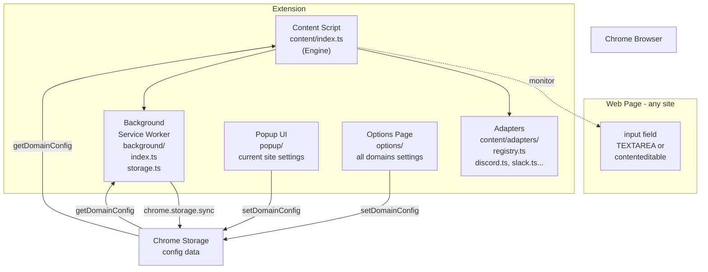
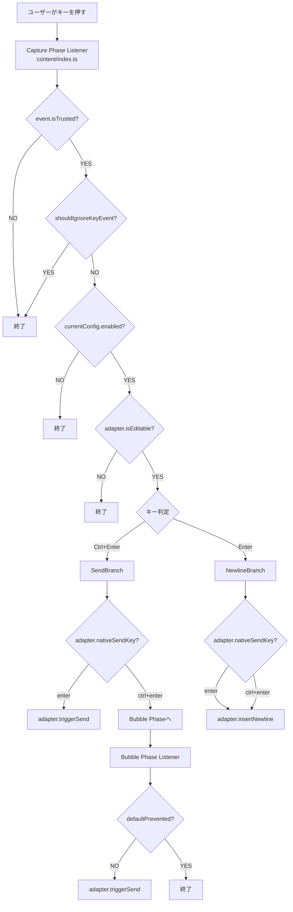

# Ctrl+Enter Sender アーキテクチャ解説

## 📋 目次

1. [全体アーキテクチャ](#全体アーキテクチャ)
2. [サイトアダプターパターン](#サイトアダプターパターン)
3. [拡張機能の起動フロー](#拡張機能の起動フロー)
4. [キーイベント処理フロー](#キーイベント処理フロー)
5. [設定管理システム](#設定管理システム)
6. [UIコンポーネント](#uiコンポーネント)

---

## 全体アーキテクチャ

### 図解：システム全体構造



### 概念説明

この拡張機能は、Chrome拡張機能の標準的な3層構造に加え、**Adapter Pattern**を採用してサイト固有のロジックを分離しています。

1. **Content Script層** (`src/content/`)
   - **Engine** (`index.ts`): サイト非依存のイベントリスナー管理とディスパッチ担当。
   - **Adapters** (`src/content/adapters/`): 各サイト固有のロジック（検出、送信、改行）をカプセル化。

2. **Background層** (`src/background/`)
   - Service Workerとして動作し、設定の永続化を担当。

3. **UI層** (`src/popup/`, `src/options/`)
   - ユーザー設定インターフェース。

---

## サイトアダプターパターン (v1.3.2以降)

v1.3.2より、サイトごとのロジックを分離するために**サイトアダプターパターン**を採用しました。

### 構造

```typescript
interface SiteAdapter {
  name: string;
  matches(hostname: string): boolean;
  listenerTarget: "window" | "document"; // サイトごとにリスナーの登録先を変える
  nativeSendKey: "enter" | "ctrl+enter";
  isEditable(element: Element, config?: DomainConfig): boolean;
  insertNewline(target: HTMLElement): void;
  triggerSend(target: HTMLElement): void;
}
```

### 動作フロー

1. **初期化**: `content/index.ts` が起動すると、`registry.ts` から現在のホスト名にマッチするアダプターを取得します（マッチしない場合は `defaultAdapter`）。
2. **リスナー登録**: アダプターの `listenerTarget` プロパティに従い、`window` または `document` にイベントリスナーを登録します。
   - 例: Claude.ai は `window` (Capture Phase) でないとイベントを捕捉できないため、アダプターで指定。
3. **イベント処理**: キーイベントが発生すると、アダプターのメソッドに委譲します。
   - `adapter.isEditable(target)`: その要素が編集可能か判定
   - `adapter.triggerSend(target)`: 送信処理（ボタンクリックやEnterシミュレーション）
   - `adapter.insertNewline(target)`: 改行挿入処理

この設計により、あるサイト（例: Discord）のロジック変更が、他のサイト（例: Slack）に影響を与えることを防いでいます。

---

## 拡張機能の起動フロー

基本的には従来と同じですが、`getAdapter()` によるアダプター解決が追加されています。

1. **インストール時**: Background Service Workerが起動。
2. **ページ読み込み時**:
   - `content/index.ts` 実行
   - `getAdapter(location.hostname)` でアダプター決定
   - `config` 読み込み
   - `adapter.listenerTarget` にイベントリスナー登録 (Capture Phase)

---

## キーイベント処理フロー


### 図解：キー入力処理の全体フロー



### 概要

1. **Capture Phase**:
   - ほとんどの処理はここで行われます。
   - **IME入力ガード**: `shouldIgnoreKeyEvent` により、IME入力中のEnterキー（変換確定）が誤って送信や改行として処理されるのを防ぎます。
   - `adapter.nativeSendKey === 'enter'` のサイト（Discord等）は、ここで送信と改行の両方を制御します。
   - `adapter.nativeSendKey === 'ctrl+enter'` のサイト（標準）は、Enter（改行化）のみここで処理し、Ctrl+EnterはBubble Phaseに任せます。

2. **Bubble Phase**:
   - 標準的なサイトでの Ctrl+Enter 送信処理を行います。
   - サイト側がイベントを処理しなかった場合のみ、`adapter.triggerSend()` を実行します。

---

## 設定管理システム

設定は`chrome.storage.sync`に保存され、以下の構造を持ちます：

```typescript
{
  ctrl_enter_sender_config: {
    domains: {
      [origin: string]: DomainConfig
    }
  }
}
```

ドメインごとに `enabled`, `customTargets`, `customExcludes` を持ちます。

**デフォルト無効ドメイン**:

- `x.com`, `twitter.com`
- `google.com` (検索)
- `docs.google.com`

---

## UIコンポーネント

- **Popup UI**: 現在のサイトの設定（ON/OFF切替、ブラックリスト/ホワイトリストモード切替）
- **Options Page**: 全ドメインの設定管理、開発者支援リンク
- **Onboarding**: 初回起動時のガイド（v1.3.2でテキスト改善）
- **多言語対応**: 34言語に対応 (`_locales/`)

---

## まとめ

v1.3.2のリファクタリングにより、**堅牢性と拡張性**が大幅に向上しました。新しいサイトへの対応は、新しいアダプターファイルを追加し、レジストリに登録するだけで完了します。
