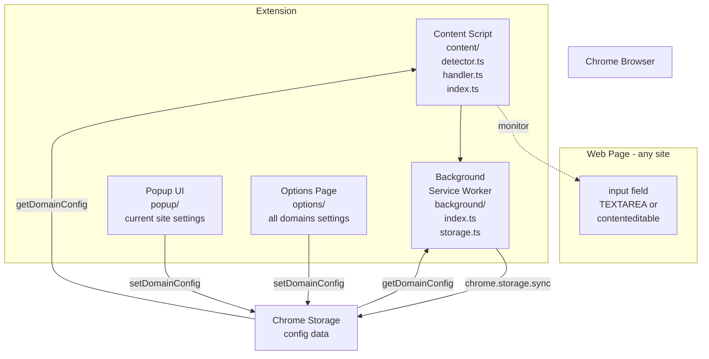
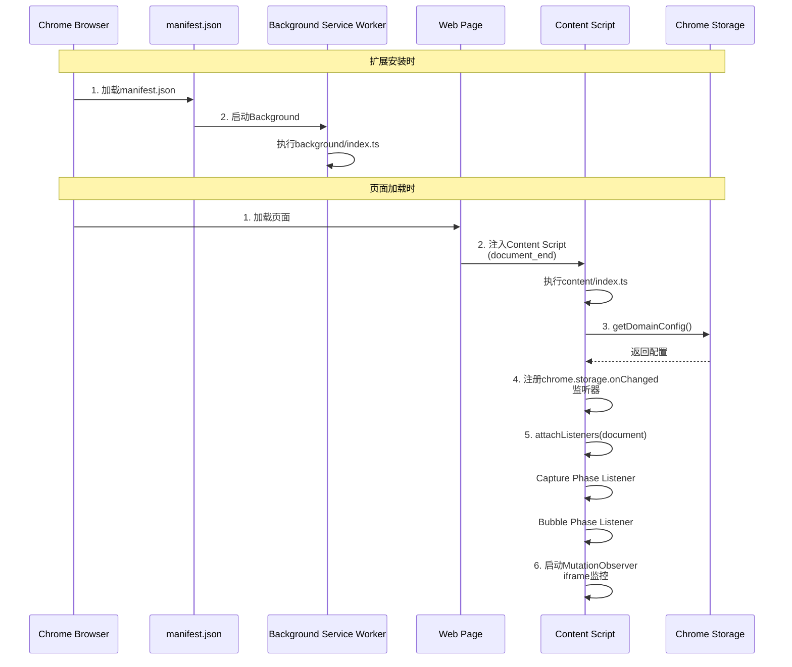

# Ctrl+Enter Sender 架构说明

## 📋 目录
1. [整体架构](#整体架构)
2. [扩展启动流程](#扩展启动流程)
3. [按键事件处理流程](#按键事件处理流程)
4. [可编辑元素检测逻辑](#可编辑元素检测逻辑)
5. [按键输入处理详情](#按键输入处理详情)
6. [配置管理系统](#配置管理系统)
7. [UI组件](#ui组件)

---

## 整体架构

### 图表：系统整体结构



### 概念说明

此扩展采用Chrome扩展的标准3层结构：

1. **Content Script层** (`src/content/`)
   - 注入到每个网页，监控页面上的输入框
   - 捕获按键事件并控制Ctrl+Enter/Enter的行为

2. **Background层** (`src/background/`)
   - 作为Service Worker运行
   - 处理存储管理和配置持久化

3. **UI层** (`src/popup/`, `src/options/`)
   - 用户更改设置的界面

---

## 扩展启动流程

### 图表：初始化序列



### 概念说明

扩展在两个时机初始化：

1. **安装时**: Background Service Worker启动并执行基本设置
2. **页面加载时**: Content Script注入到每个页面，加载页面特定配置并注册事件监听器

特别重要的是，Content Script在**Capture Phase**和**Bubble Phase**两个阶段都监控按键事件。这是因为不同网站处理Enter键的时机不同，此设计确保能够捕获事件。

---

## 按键事件处理流程

### 概念说明

按键事件处理在**两个事件阶段**进行：

1. **Capture Phase（捕获阶段）**
   - 事件从DOM树顶部向下传播的阶段
   - 在网站事件处理程序之前执行
   - Complex App（Discord、Teams、Slack、ChatGPT）：在此处理Ctrl+Enter和Enter
   - Standard App：仅在此处理Enter（防止默认发送行为）

2. **Bubble Phase（冒泡阶段）**
   - 事件从DOM树底部向上传播的阶段
   - Standard App的Ctrl+Enter仅在网站未处理时在此处理
   - 检查`event.defaultPrevented`，如果网站已处理则不干扰

此设计可兼容各种网站的行为模式。

---

## 可编辑元素检测逻辑

### 概念说明

`isMultiLineEditable()`函数按**优先级顺序**进行检查：

1. **最高优先级**: 用户设置（customExcludes, customTargets）
2. **次优先级**: 网站特定检测逻辑（Slack、Google Meet、Google Chat等）
3. **通用检测**: TEXTAREA元素或带关键字匹配的contenteditable元素

此顺序确保明确设置时优先尊重用户设置，否则尝试自动检测。

**注意**: 检测模式（mode）功能已删除，始终使用自动检测。

---

## 按键输入处理详情

### 概念说明

`handleKeyDown()`函数根据应用程序类型采用不同策略：

1. **Complex App (Discord, Teams)**
   - 这些应用使用标准行为：Enter发送，Shift+Enter插入换行
   - 要让Ctrl+Enter发送：模拟Enter事件以触发应用的发送处理
   - 要让Enter插入换行：模拟Shift+Enter事件

2. **Standard App (Slack, ChatGPT, 其他)**
   - 搜索发送按钮并点击，或尝试表单提交
   - Slack具有特殊的DOM结构，因此有专门的搜索逻辑

3. **换行插入**
   - TEXTAREA元素：使用`setRangeText()`（支持撤销/重做）
   - contenteditable元素：使用`execCommand('insertText')`（已弃用但为兼容性保留）

---

## 配置管理系统

### 概念说明

配置存储在`chrome.storage.sync`中，具有以下结构：

```typescript
{
  ctrl_enter_sender_config: {
    domains: {
      [origin: string]: DomainConfig
    }
  }
}
```

每个域名具有独立配置，包含：
- `enabled`: 扩展是否启用
- `customTargets`: 自定义选择器（明确要定位的元素）
- `customExcludes`: 自定义排除选择器（明确要排除的元素）

**注意**: `mode`属性已删除。检测始终使用自动检测。

Content Script监控存储更改并实时更新配置。

### 默认禁用域名

以下域名默认禁用：
- `x.com`, `twitter.com` (X/Twitter)
- `google.com` (Google搜索 - 子域名启用，例如：`gemini.google.com`)
- `docs.google.com` (Google Docs)

---

## UI组件

### Popup UI (`popup/App.tsx`)

弹出UI显示并编辑当前打开标签页的域名配置：

- **当前域名**: 显示当前标签页的域名
- **启用/禁用切换**: 切换当前域名的扩展启用状态
- **特殊页面支持**: 为`chrome://`或`about:`等特殊页面显示适当消息

### Options Page (`options/App.tsx`)

选项页面列出并管理所有域名的配置：

- **默认配置的域名**: 默认禁用的域名列表（可切换）
- **用户配置的域名**: 用户配置的域名列表（可切换）
- **帮助部分**: 说明如何使用扩展（可切换）
- **支持开发者部分**: 支持链接（带反向心理学营销，可切换）
- **初始化按钮**: 将所有配置重置为初始安装状态

### 入门引导

首次安装或首次启动时，显示简单的入门引导：
- 说明：Enter → 换行，Ctrl+Enter → 发送
- 说明扩展默认开启
- 引导到高级设置

### 国际化

此扩展支持30多种语言：
- 使用Chrome i18n API
- 在`_locales/{locale}/messages.json`中存储翻译
- 根据浏览器语言设置自动选择适当语言

---

## 总结

此扩展是具有以下功能的Chrome扩展：

1. **灵活的事件处理**: 在Capture和Bubble两个阶段监控按键事件，兼容各种网站行为模式
2. **智能元素检测**: 结合网站特定检测逻辑和通用检测，优先用户设置
3. **持久化配置**: 使用Chrome Storage API保存每个域名的配置
4. **用户友好的UI**: 通过Popup和Options Page轻松更改设置
5. **国际化**: 支持30多种语言

每个组件独立运行，同时通过存储协调以实现统一行为。

