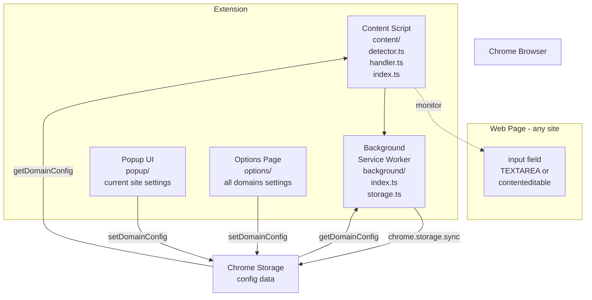
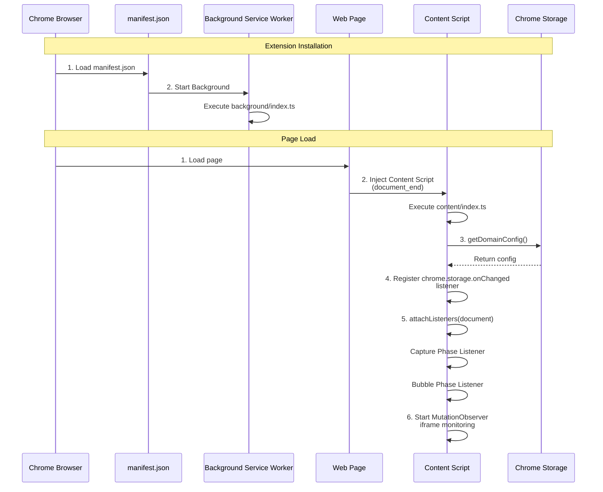
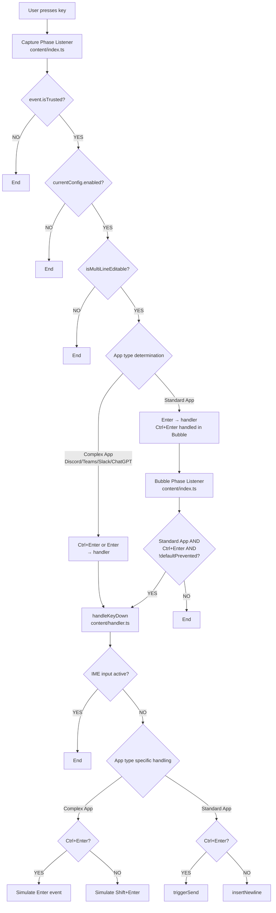
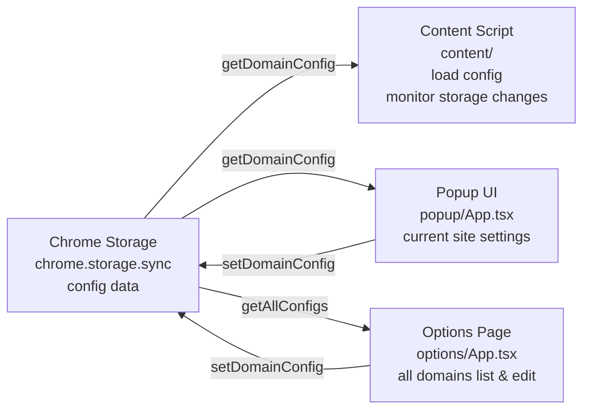

# Ctrl+Enter Sender Architecture Explanation

## 📋 Table of Contents
1. [Overall Architecture](#overall-architecture)
2. [Extension Startup Flow](#extension-startup-flow)
3. [Key Event Processing Flow](#key-event-processing-flow)
4. [Editable Element Detection Logic](#editable-element-detection-logic)
5. [Key Input Handling Details](#key-input-handling-details)
6. [Configuration Management System](#configuration-management-system)
7. [UI Components](#ui-components)

---

## Overall Architecture

### Diagram: Overall System Structure



### Concept Explanation

This extension adopts a standard 3-layer structure for Chrome extensions:

1. **Content Script Layer** (`src/content/`)
   - Injected into each web page, monitors input fields on the page
   - Captures key events and controls Ctrl+Enter/Enter behavior

2. **Background Layer** (`src/background/`)
   - Runs as a Service Worker
   - Handles storage management and configuration persistence

3. **UI Layer** (`src/popup/`, `src/options/`)
   - Interface for users to change settings

### Related Code

```1:32:manifest.json
{
    "manifest_version": 3,
    "name": "__MSG_extensionName__",
    "version": "1.0.2",
    "description": "__MSG_extensionDescription__",
    "default_locale": "en",
    "permissions": [
        "storage"
    ],
    "host_permissions": [
        "<all_urls>"
    ],
    "action": {
        "default_popup": "src/popup/index.html"
    },
    "options_page": "src/options/index.html",
    "background": {
        "service_worker": "src/background/index.ts",
        "type": "module"
    },
    "content_scripts": [
        {
            "matches": [
                "<all_urls>"
            ],
            "js": [
                "src/content/index.ts"
            ],
            "run_at": "document_end"
        }
    ]
}
```

---

## Extension Startup Flow

### Diagram: Initialization Sequence



### Concept Explanation

The extension initializes at two timings:

1. **Installation**: Background Service Worker starts and performs basic setup
2. **Page Load**: Content Script is injected into each page, loads page-specific settings, and registers event listeners

A key point is that the Content Script monitors key events in both **Capture Phase** and **Bubble Phase**. This design ensures event capture regardless of when different sites handle Enter key events.

---

## Key Event Processing Flow

### Diagram: Overall Key Input Processing Flow



### Concept Explanation

Key event processing occurs in **two event phases**:

1. **Capture Phase**
   - Event propagates from top to bottom of DOM tree
   - Executes before site event handlers
   - Complex Apps (Discord, Teams, Slack, ChatGPT): Handle both Ctrl+Enter and Enter here
   - Standard Apps: Handle only Enter here (to prevent default send behavior)

2. **Bubble Phase**
   - Event propagates from bottom to top of DOM tree
   - Standard App Ctrl+Enter is handled here only if the site didn't handle it
   - Checks `event.defaultPrevented` to avoid interfering if the site already handled it

This design allows compatibility with various site behavior patterns.

---

## Editable Element Detection Logic

### Concept Explanation

The `isMultiLineEditable()` function checks in **priority order**:

1. **Highest Priority**: User settings (customExcludes, customTargets)
2. **Next Priority**: Site-specific detection logic (Slack, Google Meet, Google Chat, etc.)
3. **Generic Detection**: TEXTAREA elements or contenteditable elements with keyword matching

This order ensures that explicit user settings are respected, and automatic detection is attempted otherwise.

**Note**: The detection mode (mode) feature has been removed, and automatic detection is always used.

---

## Key Input Handling Details

### Concept Explanation

The `handleKeyDown()` function takes different strategies depending on application type:

1. **Complex App (Discord, Teams)**
   - These apps use standard behavior: Enter sends, Shift+Enter inserts newline
   - For Ctrl+Enter to send: Simulate Enter event to trigger app's send handler
   - For Enter to insert newline: Simulate Shift+Enter event

2. **Standard App (Slack, ChatGPT, others)**
   - Searches for send button and clicks it, or attempts form submission
   - Slack has special DOM structure, so dedicated search logic exists

3. **Newline Insertion**
   - TEXTAREA elements: Use `setRangeText()` (supports Undo/Redo)
   - contenteditable elements: Use `execCommand('insertText')` (deprecated but for compatibility)

---

## Configuration Management System

### Diagram: Configuration Data Flow



### Concept Explanation

Settings are stored in `chrome.storage.sync` with the following structure:

```typescript
{
  ctrl_enter_sender_config: {
    domains: {
      [origin: string]: DomainConfig
    }
  }
}
```

Each domain has independent settings containing:
- `enabled`: Whether the extension is enabled
- `customTargets`: Custom selectors (elements to explicitly target)
- `customExcludes`: Custom exclusion selectors (elements to explicitly exclude)

**Note**: The `mode` property has been removed. Detection always uses automatic detection.

Content Script monitors storage changes and updates settings in real-time.

### Default Disabled Domains

The following domains are disabled by default:
- `x.com`, `twitter.com` (X/Twitter)
- `google.com` (Google Search - subdomains are enabled, e.g., `gemini.google.com`)
- `docs.google.com` (Google Docs)

---

## UI Components

### Popup UI (`popup/App.tsx`)

The popup UI displays and edits settings for the currently open tab's domain:

- **Current Domain**: Displays the current tab's domain
- **Enable/Disable Toggle**: Toggle extension on/off for current domain
- **Special Page Support**: Shows appropriate message for special pages like `chrome://` or `about:`

### Options Page (`options/App.tsx`)

The options page lists and manages settings for all domains:

- **Default Configured Domains**: List of domains disabled by default (toggleable)
- **User Configured Domains**: List of domains configured by user (toggleable)
- **Help Section**: Explains how to use the extension (toggleable)
- **Support Developer Section**: Support links (toggleable)
- **Reset All Button**: Resets all settings to initial installation state

### Onboarding

On first install or first launch, a simple onboarding is displayed:
- Explanation: Enter → Newline, Ctrl+Enter → Send
- Explanation that extension is ON by default
- Guide to Advanced Settings

### Internationalization

This extension supports 30+ languages:
- Uses Chrome i18n API
- Stores translations in `_locales/{locale}/messages.json`
- Automatically selects appropriate language based on browser language settings

---

## Summary

This extension is a Chrome extension with the following features:

1. **Flexible Event Processing**: Monitors key events in both Capture and Bubble phases, compatible with various site behavior patterns
2. **Smart Element Detection**: Combines site-specific detection logic with generic detection, prioritizing user settings
3. **Persistent Settings**: Uses Chrome Storage API to save per-domain settings
4. **User-Friendly UI**: Easy setting changes via Popup and Options Page
5. **Internationalization**: Supports 30+ languages

Each component operates independently while coordinating through storage to achieve unified behavior.

