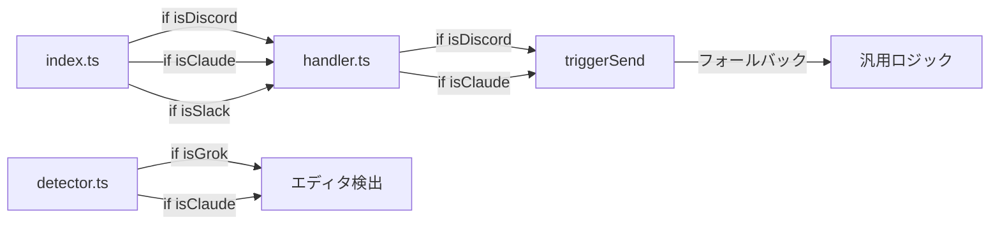
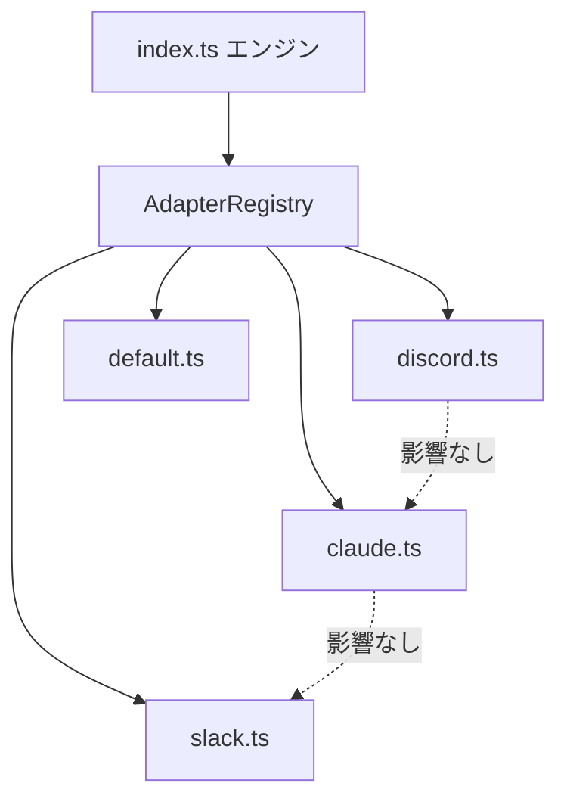

# Site Adapter アーキテクチャへのリファクタリング

## 問題

現在のコードは `index.ts`, `handler.ts`, `detector.ts` の3ファイルに **サイト固有ロジックが散在** しており、1サイトの修正が他サイトに影響する。



**具体的な問題:**

- Claude.ai 対策で `window` にリスナーを移動 → Discord に影響
- Discord 用の `triggerSend` が**存在しない**（汎用フォールバックに依存）
- 新サイト追加のたびに3ファイルを横断的に修正する必要がある

---

## 設計方針

### Site Adapter パターン

各サイトの固有ロジックを **1つのアダプタファイルに完全に閉じ込める**。



---

## Proposed Changes

### Core Interface

#### [NEW] [types.ts 追記](file:///home/kimura512/dev/ctrlEnterSenderA/src/content/types.ts)

`SiteAdapter` インターフェースを定義:

```typescript
export interface SiteAdapter {
  /** このアダプタが対応するサイトか判定 */
  matches(hostname: string): boolean;

  /** イベントリスナーの設定 */
  listenerTarget: "window" | "document";
  useCapture: boolean;

  /** 要素がこのサイトの編集エリアか判定 */
  isEditable(element: Element): boolean;

  /** 改行挿入 */
  insertNewline(target: HTMLElement): void;

  /** 送信トリガー */
  triggerSend(target: HTMLElement): void;

  /** 送信のネイティブ動作（Enter送信 or Ctrl+Enter送信） */
  nativeSendKey: "enter" | "ctrl+enter";
}
```

> [!IMPORTANT]
> `listenerTarget` がアダプタ単位で定義されるので、Claude.ai 用に `window` を使っても Discord には影響しない。

---

### Adapters

#### [NEW] [adapters/discord.ts](file:///home/kimura512/dev/ctrlEnterSenderA/src/content/adapters/discord.ts)

- `matches`: `hostname.includes('discord.com')`
- `listenerTarget`: `'document'` ←元の動作を維持
- `nativeSendKey`: `'enter'`
- `isEditable`: `role === 'textbox'` チェック
- `triggerSend`: Discord 専用のボタン検索ロジック追加
- `insertNewline`: Shift+Enter シミュレーション

#### [NEW] [adapters/claude.ts](file:///home/kimura512/dev/ctrlEnterSenderA/src/content/adapters/claude.ts)

- `listenerTarget`: `'window'` ←Claude 専用
- `isEditable`: `.closest('.tiptap.ProseMirror')`
- `triggerSend`: 既存の Claude 専用ロジック移植
- `insertNewline`: Shift+Enter シミュレーション

#### [NEW] [adapters/slack.ts](file:///home/kimura512/dev/ctrlEnterSenderA/src/content/adapters/slack.ts)

#### [NEW] [adapters/grok.ts](file:///home/kimura512/dev/ctrlEnterSenderA/src/content/adapters/grok.ts)

#### [NEW] [adapters/chatgpt.ts](file:///home/kimura512/dev/ctrlEnterSenderA/src/content/adapters/chatgpt.ts)

#### [NEW] [adapters/teams.ts](file:///home/kimura512/dev/ctrlEnterSenderA/src/content/adapters/teams.ts)

#### [NEW] [adapters/default.ts](file:///home/kimura512/dev/ctrlEnterSenderA/src/content/adapters/default.ts)

- 汎用フォールバック（textarea、contentEditable の標準検出）

---

### Registry

#### [NEW] [adapters/registry.ts](file:///home/kimura512/dev/ctrlEnterSenderA/src/content/adapters/registry.ts)

```typescript
export function getAdapter(hostname: string): SiteAdapter {
  for (const adapter of adapters) {
    if (adapter.matches(hostname)) return adapter;
  }
  return defaultAdapter;
}
```

- アダプタの優先順で配列に登録
- マッチしなければ `defaultAdapter` を返す

---

### Engine (リファクタリング)

#### [MODIFY] [index.ts](file:///home/kimura512/dev/ctrlEnterSenderA/src/content/index.ts)

- **サイト固有のif文を全て削除**
- `getAdapter(hostname)` でアダプタ取得
- `adapter.listenerTarget` に基づいてリスナー登録先を決定
- `adapter.isEditable()` でエディタ判定
- Enter / Ctrl+Enter の判定後、`adapter.insertNewline()` or `adapter.triggerSend()` を呼ぶ

#### [DELETE] [handler.ts](file:///home/kimura512/dev/ctrlEnterSenderA/src/content/handler.ts)

- ロジックは各アダプタに分散。このファイルは不要に。

#### [DELETE] [detector.ts](file:///home/kimura512/dev/ctrlEnterSenderA/src/content/detector.ts)

- 各アダプタの `isEditable()` に移行。このファイルは不要に。

---

## ファイル構成（変更後）

```
src/content/
├── index.ts           # エンジン（サイト非依存）
├── types.ts           # SiteAdapter インターフェース  [NEW]
└── adapters/          # サイト固有ロジック           [NEW]
    ├── registry.ts    # アダプタ登録・取得
    ├── default.ts     # 汎用フォールバック
    ├── discord.ts
    ├── claude.ts
    ├── slack.ts
    ├── grok.ts
    ├── chatgpt.ts
    └── teams.ts
```

---

## メリット

| Before                                  | After                                    |
| --------------------------------------- | ---------------------------------------- |
| Claude 修正 → Discord 壊れる            | アダプタ単位で隔離、影響なし             |
| 新サイト追加 = 3ファイル修正            | 新アダプタ1ファイル追加 + registry に1行 |
| `triggerSend` に Discord 用ロジックなし | 各アダプタが自分の送信ロジックを持つ     |
| テスト困難                              | アダプタ単体でテスト可能                 |

---

## Verification Plan

### ビルド確認

- `pnpm build` が通ること

### 手動テスト（各サイトで確認）

- [ ] Discord: Enter=改行、Ctrl+Enter=送信
- [ ] Claude.ai: Enter=改行、Ctrl+Enter=送信
- [ ] ChatGPT: Enter=改行、Ctrl+Enter=送信
- [ ] Slack: Enter=改行、Ctrl+Enter=送信
- [ ] Grok: Enter=改行、Ctrl+Enter=送信
- [ ] 汎用サイト: Enter=改行、Ctrl+Enter=送信
