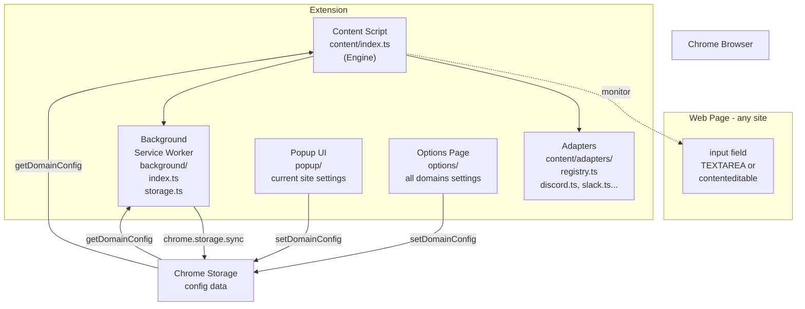
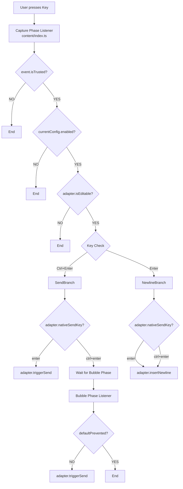

# Ctrl+Enter Sender Architecture Explanation

## 📋 Table of Contents

1. [Overall Architecture](#overall-architecture)
2. [Site Adapter Pattern](#site-adapter-pattern)
3. [Extension Startup Flow](#extension-startup-flow)
4. [Key Event Processing Flow](#key-event-processing-flow)
5. [Configuration Management System](#configuration-management-system)
6. [UI Components](#ui-components)

---

## Overall Architecture

### Diagram: Overall System Structure



### Concept Explanation

This extension adopts a standard 3-layer structure for Chrome extensions, plus the **Adapter Pattern** to isolate site-specific logic.

1. **Content Script Layer** (`src/content/`)
   - **Engine** (`index.ts`): Site-agnostic event listener management and dispatching.
   - **Adapters** (`src/content/adapters/`): Encapsulates site-specific logic (detection, sending, newline insertion).

2. **Background Layer** (`src/background/`)
   - Runs as a Service Worker, handling configuration persistence.

3. **UI Layer** (`src/popup/`, `src/options/`)
   - User settings interface.

---

## Site Adapter Pattern (v1.3.2+)

From v1.3.2, we adopted the **Site Adapter Pattern** to decouple site-specific logic.

### Structure

```typescript
interface SiteAdapter {
  name: string;
  matches(hostname: string): boolean;
  listenerTarget: "window" | "document"; // Change listener target per site
  nativeSendKey: "enter" | "ctrl+enter";
  isEditable(element: Element, config?: DomainConfig): boolean;
  insertNewline(target: HTMLElement): void;
  triggerSend(target: HTMLElement): void;
}
```

### Operation Flow

1. **Initialization**: When `content/index.ts` starts, it retrieves the matching adapter for the current hostname from `registry.ts` (or `defaultAdapter` if no match).
2. **Listener Registration**: Registers event listeners on `window` or `document` according to the adapter's `listenerTarget` property.
   - Example: Claude.ai requires `window` (Capture Phase) to capture events, so it's specified in the adapter.
3. **Event Processing**: When a key event occurs, it delegates to the adapter's methods.
   - `adapter.isEditable(target)`: Determines if the element is editable.
   - `adapter.triggerSend(target)`: Handles sending (button click or Enter simulation).
   - `adapter.insertNewline(target)`: Handles newline insertion.

This design prevents logic changes for one site (e.g., Discord) from affecting other sites (e.g., Slack).

---

## Extension Startup Flow

Basically the same as before, but with `getAdapter()` added for adapter resolution.

1. **Installation**: Background Service Worker starts.
2. **Page Load**:
   - `content/index.ts` executes.
   - Determines adapter with `getAdapter(location.hostname)`.
   - Loads `config`.
   - Registers event listeners to `adapter.listenerTarget` (Capture Phase).

---

## Key Event Processing Flow

### Diagram: Overall Key Input Processing Flow



### Overview

1. **Capture Phase**:
   - Most processing happens here.
   - Sites where `adapter.nativeSendKey === 'enter'` (Discord, etc.) handle both sending and newline here.
   - Sites where `adapter.nativeSendKey === 'ctrl+enter'` (Standard) handle only Enter (to force newline) here, and leave Ctrl+Enter to the Bubble Phase.

2. **Bubble Phase**:
   - Handles Ctrl+Enter sending for standard sites.
   - Executes `adapter.triggerSend()` only if the site didn't handle the event internally.

---

## Configuration Management System

Settings are stored in `chrome.storage.sync` with the following structure:

```typescript
{
  ctrl_enter_sender_config: {
    domains: {
      [origin: string]: DomainConfig
    }
  }
}
```

Each domain has `enabled`, `customTargets`, and `customExcludes`.

**Default Disabled Domains**:

- `x.com`, `twitter.com`
- `google.com` (Search)
- `docs.google.com`

---

## UI Components

- **Popup UI**: Current site settings (ON/OFF)
- **Options Page**: All domain settings, developer support links
- **Onboarding**: Guide on first launch (text improved in v1.3.2)
- **Internationalization**: Supports 37 languages (`_locales/`)

---

## Summary

The refactoring in v1.3.2 significantly improved **robustness and extensibility**. Supporting a new site is now as simple as adding a new adapter file and registering it in the registry.
