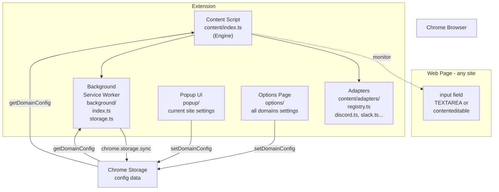
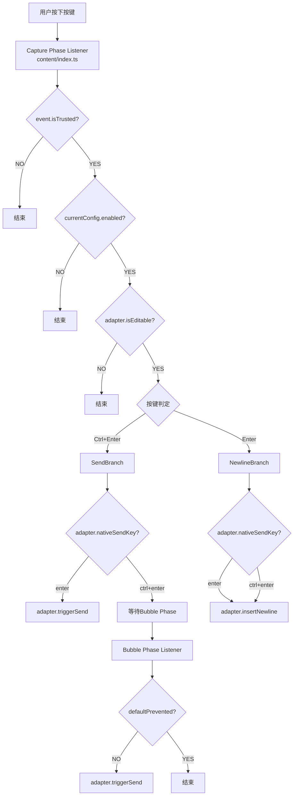

# Ctrl+Enter Sender 架构说明

## 📋 目录

1. [整体架构](#整体架构)
2. [站点适配器模式](#站点适配器模式)
3. [扩展启动流程](#扩展启动流程)
4. [按键事件处理流程](#按键事件处理流程)
5. [配置管理系统](#配置管理系统)
6. [UI组件](#ui组件)

---

## 整体架构

### 图表：系统整体结构



### 概念说明

此扩展采用了Chrome扩展的标准3层结构，并引入了**Adapter Pattern（适配器模式）**以隔离特定于站点的逻辑。

1. **Content Script层** (`src/content/`)
   - **Engine** (`index.ts`): 与站点无关的事件监听器管理和分发负责。
   - **Adapters** (`src/content/adapters/`): 封装每个站点特定的逻辑（检测、发送、换行）。

2. **Background层** (`src/background/`)
   - 作为Service Worker运行，负责配置持久化。

3. **UI层** (`src/popup/`, `src/options/`)
   - 用户设置界面。

---

## 站点适配器模式 (v1.3.2+)

从 v1.3.2 开始，为了分离每个站点的逻辑，我们采用了**站点适配器模式**。

### 结构

```typescript
interface SiteAdapter {
  name: string;
  matches(hostname: string): boolean;
  listenerTarget: "window" | "document"; // 每个站点更改监听器注册目标
  nativeSendKey: "enter" | "ctrl+enter";
  isEditable(element: Element, config?: DomainConfig): boolean;
  insertNewline(target: HTMLElement): void;
  triggerSend(target: HTMLElement): void;
}
```

### 运行流程

1. **初始化**: 当 `content/index.ts` 启动时，它会从 `registry.ts` 获取与当前主机名匹配的适配器（如果不匹配，则为 `defaultAdapter`）。
2. **注册监听器**: 根据适配器的 `listenerTarget` 属性，将事件监听器注册到 `window` 或 `document`。
   - 例如: Claude.ai 需要 `window` (Capture Phase) 才能捕获事件，因此在适配器中指定。
3. **事件处理**: 当发生按键事件时，它会委托给适配器的方法。
   - `adapter.isEditable(target)`: 判定该元素是否可编辑
   - `adapter.triggerSend(target)`: 发送处理（按钮点击或模拟Enter）
   - `adapter.insertNewline(target)`: 插入换行处理

这种设计防止了一个站点（例如: Discord）的逻辑更改影响其他站点（例如: Slack）。

---

## 扩展启动流程

基本与以前相同，但添加了 `getAdapter()` 用于解析适配器。

1. **安装时**: Background Service Worker启动。
2. **页面加载时**:
   - 执行 `content/index.ts`
   - 通过 `getAdapter(location.hostname)` 确定适配器
   - 读取 `config`
   - 将事件监听器注册到 `adapter.listenerTarget` (Capture Phase)

---

## 按键事件处理流程

### 图表：按键输入处理的整体流程



### 概述

1. **Capture Phase (捕获阶段)**:
   - 大部分处理都在这里进行。
   - `adapter.nativeSendKey === 'enter'` 的站点（Discord等）在此控制发送和换行。
   - `adapter.nativeSendKey === 'ctrl+enter'` 的站点（标准）仅在此处理Enter（强制换行），并将Ctrl+Enter留给Bubble Phase。

2. **Bubble Phase (冒泡阶段)**:
   - 处理标准站点的Ctrl+Enter发送。
   - 仅当站点未在内部处理事件时，才执行 `adapter.triggerSend()`。

---

## 配置管理系统

配置存储在`chrome.storage.sync`中，具有以下结构：

```typescript
{
  ctrl_enter_sender_config: {
    domains: {
      [origin: string]: DomainConfig
    }
  }
}
```

每个域名都有 `enabled`, `customTargets`, `customExcludes`。

**默认禁用域名**:

- `x.com`, `twitter.com`
- `google.com` (搜索)
- `docs.google.com`

---

## UI组件

- **Popup UI**: 当前站点设置（ON/OFF）
- **Options Page**: 所有域名设置管理，开发者支持链接
- **Onboarding**: 首次启动时的指南（v1.3.2改进了文本）
- **国际化**: 支持37种语言 (`_locales/`)

---

## 总结

v1.3.2的重构显着提高了**健壮性和可扩展性**。支持新站点现在只需添加新的适配器文件并在注册表中注册即可完成。
